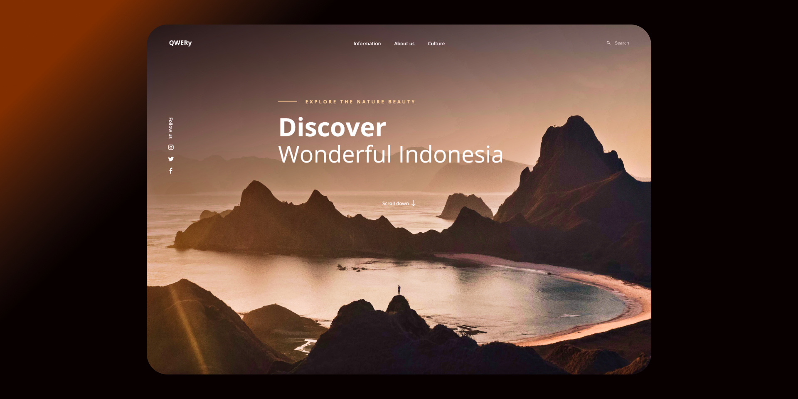

# QWERY - Landing Page




Essa landing page foi criada com dedicação para oferecer a melhor experiência aos visitantes interessados no turismo na Indonésia. Utilizamos as tecnologias Vite e TypeScript para garantir uma página web fluida, responsiva e de alto desempenho.

Com um design moderno e elegante, se criar uma experiência de usuário envolvente e intuitiva. Através do uso de Vite, um poderoso framework de desenvolvimento rápido, garantimos um desempenho excepcionalmente rápido e eficiente, permitindo que os visitantes desfrutem de uma navegação suave e sem interrupções.

Além disso, foi aproveitado toda a potencial do TypeScript para oferecer um código mais robusto, seguro e de fácil manutenção.

## Demonstração

Visualize a versão em produção da landing page: [QWERy](https://qwer-y-umber.vercel.app/)

## Rodando localmente

Clone o projeto

```bash
  git clone https://github.com/IgorPimentelG/QWERy.git
```

Entre no diretório do projeto

```bash
  cd QWERy
```

Instale as dependências

```bash
  npm install
```

Execute o build

```bash
  npm run build
```

Execute o servidor

```bash
  npm run preview
```

## Libs

- react-reveal (v1.2.2)
- react-icons (v4.9.0)
- react-lazy-load-image-component (v1.6.0)

## Colaboradores

- [@IgorPimentelG](https://www.github.com/IgorPimentelG)


## Feedback

Se você tiver algum feedback, por favor nos deixe saber por meio de dev.igorpimentel@gmail.com

## Créditos

Design by Agtian Rain

Disponível em
[Figma Community](https://www.figma.com/community/file/1009084511604261924)

